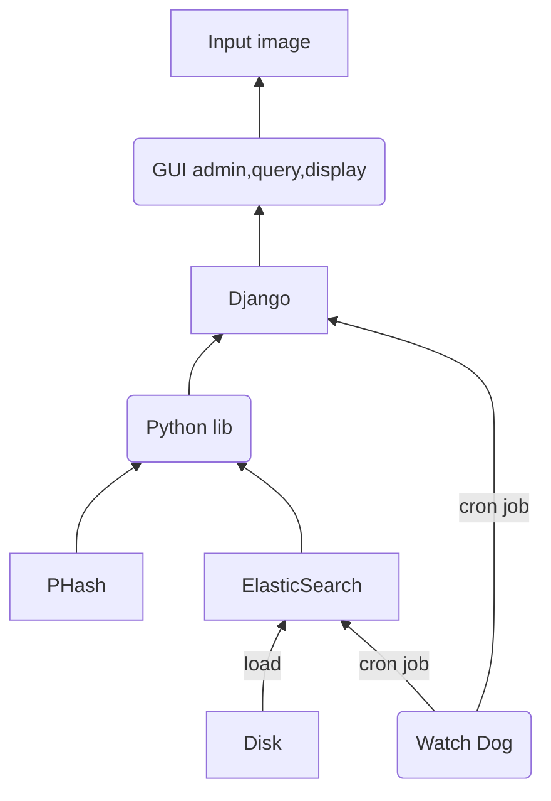

### Architecture

ModelImageSearch provide the feature to load disk image to database and provide Web GUI to user to query and management.

it accept a image input and search similar images from database by [phash](http://www.phash.org/). 

it also provide a admin GUI to add new images or delete images from database.

